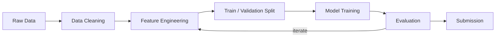

# Kaggle Project: Titanic — Machine Learning from Disaster

> **Competition:** [Titanic](https://www.kaggle.com/competitions/titanic)
> **Goal:** Predict which passengers survived the Titanic shipwreck (binary classification).
> **Metric:** Accuracy (percentage of correct predictions).

## Pipeline



## Quick Start

```bash
# 1. Clone this repo
gh repo clone benoit-bremaud/kaggle-titanic

# 2. Setup environment
make setup

# 3. Download competition data
make data COMPETITION=titanic

# 4. Start working
make notebook
```

## Project Structure

```
.
├── data/
│   ├── raw/              # Original competition data (gitignored)
│   └── processed/        # Cleaned/transformed data (gitignored)
├── notebooks/
│   └── notebook.ipynb    # Main analysis notebook (9 sections)
├── src/
│   ├── __init__.py
│   ├── utils.py          # Data loading and submission helpers
│   └── features.py       # Feature engineering functions (tested)
├── tests/
│   └── test_features.py  # Unit tests for feature functions (15 tests)
├── outputs/
│   ├── models/           # Saved models (gitignored)
│   └── submissions/      # Submission CSVs + score log
├── .github/
│   └── workflows/
│       └── ci.yml        # CI pipeline (ruff + pytest)
├── .pre-commit-config.yaml
├── Makefile              # Automation commands
├── setup.sh              # Environment setup script
├── requirements.txt      # Python dependencies
├── pyproject.toml        # Project config + ruff settings
├── DECISIONS.md          # Architectural decisions
└── CONTRIBUTING.md       # Git workflow and conventions
```

## Current Results

| # | Model | CV Score | LB Score | Features |
| --- | --- | --- | --- | --- |
| 1 | Random Forest (100 trees) | ~0.80 | TBD | Pclass, Sex, Age, SibSp, Parch, Fare, Embarked, HasCabin, FamilySize, IsAlone, Title |

## Available Commands

| Command | Description |
| --- | --- |
| `make setup` | Install dependencies, configure hooks |
| `make notebook` | Launch Jupyter Lab |
| `make lint` | Check code quality with ruff |
| `make format` | Auto-format code with ruff |
| `make clean` | Remove temporary files |
| `make data COMPETITION=titanic` | Download competition data via Kaggle API |
| `make submit COMPETITION=titanic FILE=path` | Submit predictions via Kaggle API |

## Decisions

See [DECISIONS.md](DECISIONS.md) for project-specific architectural decisions.
See the [global DECISIONS.md](../DECISIONS.md) for decisions that apply to all Kaggle projects.

## Evolution Roadmap

| Phase | Addition | Trigger |
| --- | --- | --- |
| Phase 1 (current) | Makefile + nbstripout + pre-commit + ruff | Initial setup |
| Phase 2 (current) | GitHub Actions CI (ruff + pytest) | Implemented |
| Phase 3 | Hyperparameter tuning, ensemble models | After first submission |
| Phase 4 | DVC for data versioning | Datasets > 500MB |
| Phase 5 | Docker devcontainer | Collaboration or GPU needs |

## License

[MIT](LICENSE)
